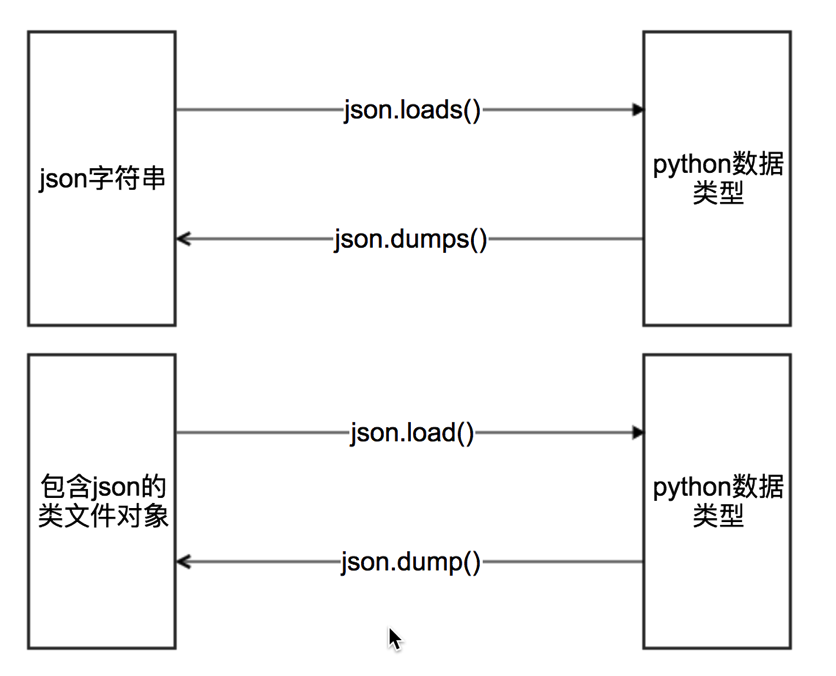
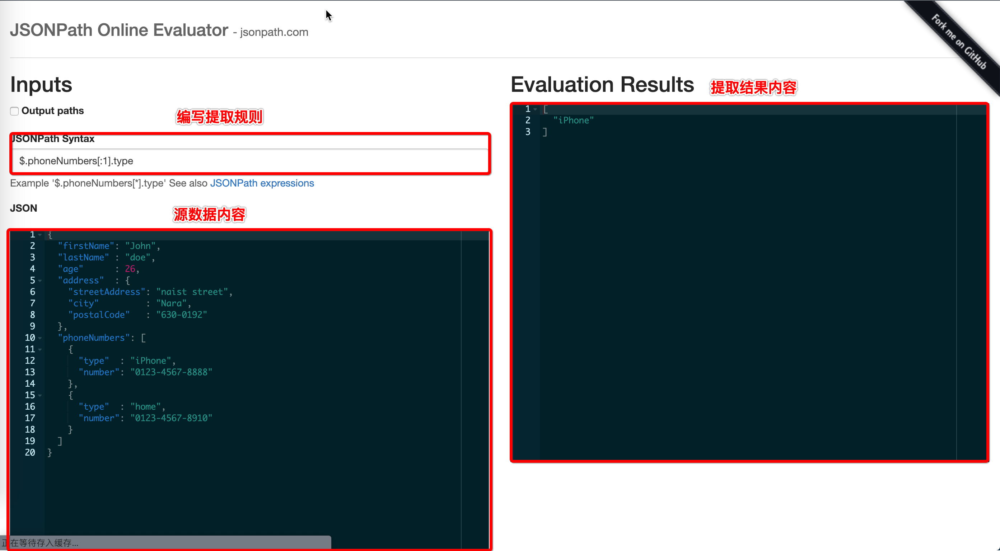

   * [JOSN 数据提取](#josn-数据提取)
      * [JSON 数据格式](#json-数据格式)
         * [定义](#定义)
         * [作用](#作用)
         * [获取方式](#获取方式)
         * [格式化方式](#格式化方式)
      * [JSON 模块使用](#json-模块使用)
         * [方法介绍](#方法介绍)
         * [代码演练](#代码演练)
      * [JsonPath](#jsonpath)
         * [介绍](#介绍)
         * [环境搭建](#环境搭建)
            * [在线调试地址](#在线调试地址)
            * [在线调试环境说明](#在线调试环境说明)
            * [调试测试数据](#调试测试数据)
         * [语法规则](#语法规则)
         * [jsonpath 代码演练](#jsonpath-代码演练)
            * [模块安装](#模块安装)
            * [需求](#需求)
            * [实现步骤](#实现步骤)
         * [代码实现](#代码实现)
      * [总结](#总结)

# JOSN 数据提取
## JSON 数据格式
### 定义

> JSON(JavaScript Object Notation) 是一种轻量级的数据交换格式，它使得人们很容易的进行阅读和编写。同时也方便了机器进行解析和生成。适用于进行数据交互的场景，比如网站前台与后台之间的数据交互。

### 作用


### 获取方式
- ajax 请求接口
- 切换手机移动h5端
- app抓包获取
- 等等

### 格式化方式
- 安装 chrome 插件 JSONView
- 在chrome中的请求详情中使用 preview 查看
- 使用在线JSON格式化工具，例如：https://www.bejson.com/

## JSON 模块使用
### 方法介绍


- json.loads json字符串 转 Python数据类型
- json.dumps Python数据类型 转 json字符串
- json.load json文件 转 Python数据类型
- json.dump Python数据类型 转 json文件
	- ensure_ascii=False 实现让中文写入的时候保持为中文
	- indent=空格数 通过空格的数量进行缩紧

### 代码演练
```python3
#!/usr/bin/python3
# -*- coding: utf-8 -*-
# 导入模块
import json

# json.loads json字符串 转 Python数据类型
json_string = '''
{
    "name": "crise",
    "age": 18,
    "parents": {
        "monther": "妈妈",
        "father": "爸爸"
    }
}
'''
print("json_string数据类型：",type(json_string))
data = json.loads(json_string)
print("data数据类型：",type(data))
print(data)
print("*" * 100)
# json.dumps Python数据类型 转 json字符串
data = {
    "name": "crise",
    "age": 18,
    "parents": {
        "monther": "妈妈",
        "father": "爸爸"
    }
}
print("data数据类型：",type(data))
json_string = json.dumps(data)
print("json_string数据类型：",type(json_string))
print(json_string)

print("*"*100)
# json.load json文件 转 Python数据类型
with open('data.json','r',encoding='utf-8') as f:
    data = json.load(f)
    print("data数据类型：", type(data))
    print(data)

print("*"*100)
# json.dump Python数据类型 转 json文件
data = {
    "name": "crise",
    "age": 18,
    "parents": {
        "monther": "妈妈",
        "father": "爸爸"
    }
}
with open('data_out.json','w',encoding='utf-8') as f:
    json.dump(data,f,ensure_ascii=False,indent=2)
```

## JsonPath
### 介绍
> 用来解析多层嵌套的json数据;JsonPath 是一种信息抽取类库，是从JSON文档中抽取指定信息的工具，提供多种语言实现版本，包括：Javascript, Python， PHP 和 Java。

``本质``： 通过一种语法规则快速从 JSON 数据中提取数据。类似于 正则表达式 通过一定规则从 text 文本内容提取数据。

### 环境搭建
#### 在线调试地址
- 使用在线调试环境 http://jsonpath.com/

#### 在线调试环境说明


#### 调试测试数据
```json
{ 
  "store": {
    "book": [ 
      { "category": "reference",
        "author": "Nigel Rees",
        "title": "Sayings of the Century",
        "price": 8.95
      },
      { "category": "fiction",
        "author": "Evelyn Waugh",
        "title": "Sword of Honour",
        "price": 12.99
      },
      { "category": "fiction",
        "author": "Herman Melville",
        "title": "Moby Dick",
        "isbn": "0-553-21311-3",
        "price": 8.99
      },
      { "category": "fiction",
        "author": "J. R. R. Tolkien",
        "title": "The Lord of the Rings",
        "isbn": "0-395-19395-8",
        "price": 22.99
      }
    ],
    "bicycle": {
      "color": "red",
      "price": 19.95
    }
  }
}
```
### 语法规则
| 语法         | 描述               | 案例          |
|-------------|-------------------|---------------|
| $           | 根节点             |
| @           | 现行节点           |
| .           | 取子节点           | $.store.book  |
| ..          | 取子孙节点         | $..book        |
| []          | 设置筛选条件        | $..book[0]     |
| [,]         | 支持多选选择内容    | $..book[1,3]     |
| ()          | 支持表达式计算      | $..book[(@.length - 1)]  |
| ?()         | 支持过滤操作        | $..book[?(@.price<10)]    |


### jsonpath 代码演练
#### 模块安装
> pip install jsonpath


#### 需求
> 从 http://www.lagou.com/lbs/getAllCitySearchLabels.json 接口返回数据中提取所有的城市信息

#### 实现步骤
1. 网络获取数据
2. 把响应数据转换成python数据类型
3. 使用 jsonpath 提取数据

### 代码实现
```python3
#!/usr/bin/python3
# -*- coding: utf-8 -*-

# 网络获取数据
import requests
import json
import jsonpath

url = "http://www.lagou.com/lbs/getAllCitySearchLabels.json"
headers = {
    "User-Agent": "Mozilla/5.0 (Macintosh; Intel Mac OS X 10_14_0) AppleWebKit/537.36 (KHTML, like Gecko) Chrome/71.0.3578.98 Safari/537.36"
}

response = requests.get(url,headers=headers)
html = response.text
print(html)
# 把响应数据转换成python数据类型
data = json.loads(html)

# 使用 jsonpath 提取数据
cities = jsonpath.jsonpath(data,'$..name')
print(cities)
```

## 总结
- JSON(JavaScript Object Notation) 是一种轻量级的数据交换格式
- JSON相关的方法
	- json.loads json字符串 转 Python数据类型
	- json.dumps Python数据类型 转 json字符串
	- json.load json文件 转 Python数据类型
	- json.dump Python数据类型 转 json文件
- jsonpath 是一种语法规则快速从 JSON 数据中提取数据。
- jsonpath 基本语法
	- $ 根节点
	- . 下一个节点
	- .. 子孙节点
	- [] 筛选条件，可以编写下标
	


